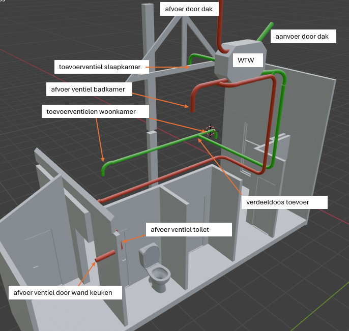

# Waar op te letten

Het is belangrijk om ventilatiekanalen zo aan te leggen dat er zo weinig mogelijk geluid kan ontstaan. Dat betekent dat de snelheid van de luchtstroom zo laag mogelijk moet zijn. Wervelingen in de lucht moeten worden voorkomen. Een lage luchtsnelheid wordt bereikt door kanalen te kiezen met een ruime diameter. Wervelingen worden beperkt door ventilatiekanalen te gebruiken die van binnen glad zijn, geen vertakkingen hebben en aangelegd zijn met zo min mogelijk scherpe of haakse bochten. De klassieke metalen ventilatiekanalen waarvan de elementen met parkers of popnagels met elkaar worden verbonden, met T-splitsingen en rechte hoeken, zijn af te raden. Veel beter zijn kanalen die met ruime bochten en zonder vertakkingen kunnen worden aangelegd zoals flexibele kunststof kanalen. Tijdens de bouw is het belangrijk te voorkomen dat ventilatiekanalen vervuild raken (bijvoorbeeld met bouwstof of zand) of beschadigen (indeuken).

# De balansventilatieberekening

| Ruimte | 	Eis |
| ---- | ---- |
| Verblijfsgebied	| > 0,9 dm3/s per m2  vloeroppervlakte  met een minimum van 7 dm3/s |
| Verblijfsruimte	| > 0,7 dm3/s per m2 vloeroppervlakte, met een minimum van 7 dm3/s |
| Toiletruimte |	> 7 dm3/s |
| Badruimte |	> 14 dm3/s |
| Keuken |	> 21 dm3/s (opstelplaats max. 15 kW) |
| Meterruimte |	> 2 dm3/s per m3 netto-inhoud van de meterruimte, met een minimum van 2 dm3/s |

# Principe ontwerp

# Welke WTW?

https://orcon.nl/product/hrc-optiair/

# Geraadpleegde bronnen

- https://meereco.nl/ventilatie/balansventilatie-aanleggen-in-bestaande-woning/

- https://www.installatie.nl/artikelen/veelgestelde-vragen-over-balansventilatie/

- https://alphaventilatie.nl/ventilatie/ventilatieberekening-maken/

- https://gathering.tweakers.net/forum/list_messages/2046242
