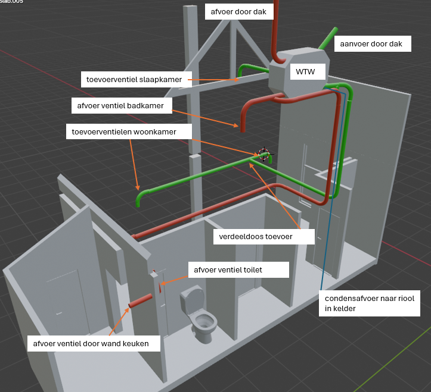

# Waar op te letten

Het is belangrijk om ventilatiekanalen zo aan te leggen dat er zo weinig mogelijk geluid kan ontstaan. Dat betekent dat de snelheid van de luchtstroom zo laag mogelijk moet zijn. Wervelingen in de lucht moeten worden voorkomen. Een lage luchtsnelheid wordt bereikt door kanalen te kiezen met een ruime diameter. Wervelingen worden beperkt door ventilatiekanalen te gebruiken die van binnen glad zijn, geen vertakkingen hebben en aangelegd zijn met zo min mogelijk scherpe of haakse bochten. De klassieke metalen ventilatiekanalen waarvan de elementen met parkers of popnagels met elkaar worden verbonden, met T-splitsingen en rechte hoeken, zijn af te raden. Veel beter zijn kanalen die met ruime bochten en zonder vertakkingen kunnen worden aangelegd zoals flexibele kunststof kanalen. Tijdens de bouw is het belangrijk te voorkomen dat ventilatiekanalen vervuild raken (bijvoorbeeld met bouwstof of zand) of beschadigen (indeuken).

# De balansventilatieberekening

## Eisen

| Ruimte | 	Eis |
| ---- | ---- |
| Verblijfsgebied	| > 0,9 dm3/s per m2  vloeroppervlakte  met een minimum van 7 dm3/s |
| Verblijfsruimte	| > 0,7 dm3/s per m2 vloeroppervlakte, met een minimum van 7 dm3/s |
| Toiletruimte |	> 7 dm3/s |
| Badruimte |	> 14 dm3/s |
| Keuken |	> 21 dm3/s (opstelplaats max. 15 kW) |
| Meterruimte |	> 2 dm3/s per m3 netto-inhoud van de meterruimte, met een minimum van 2 dm3/s |

In een ventilatieberekening moet je ook rekening houden met de luchtsnelheden. Deze worden uitgedrukt in meter per seconde (m/s). Over het algemeen moet je rekening houden met de volgende waarden voor het berekenen van het toevoer- en afvoerdebiet:

| Kanaal |	Waarde |
| ---- | ---- |
| Hoofdkanaal (distributiekanaal)|	5 m/s |
| Aftakkingskanaal |	3 m/s |

Bij een WTW unit is het belangrijk dat de aanzuig van buitenaf gelijk aan of kleiner is dan 3 m/s. Dit trekt namelijk ook regenwater aan. Voor de uitblaas van de WTW unit wordt ongeveer 8 m/s aangehouden.

Verder is het goed om de afstand tussen de ventilatieventielen te noteren. Dit gaat om de afvoer- en toevoerventielen. Een afvoerventiel draagt zorg voor de afvoer van lucht naar het ventilatiesysteem. Deze ventielen bevinden zich in natte ruimtes, zoals de badkamer, keuken, berging en het toilet. In sommige gevallen kan het zo zijn dat er een afvoerventiel in een leefruimte is geplaatst, zoals de woonkamer. Daarnaast wordt een toevoerventiel gebruikt voor de toevoer van lucht vanuit een ventilatiesysteem. Deze bevinden zich vaak in leefruimtes, zoals de woonkamer, slaapkamer, eetkamer en het kantoor.

Voor de ventilatieberekening heb je de afstand tussen de afvoer- en toevoerventielen en de luchtverplaatsing nodig. De afstand tussen de ventielen wordt uitgedrukt in meters en de luchtverplaatsing in m3/h. Voor deze waarden gelden de volgende algemene regels.

| Soort ventiel |  Maximale luchtverplaatsing per ventiel m3/h |
| ---- | ---- |
| Toevoerventiel|	Maximaal 50m3/h |
| Afvoerventiel	| Maximaal 75m3/h |

## De ventilatie in balans brengen

| Ruimte | Inhoud | Oppervlakte | Hoogte | 
| ----- | ----- | ----- | ---- |
| Woonkamer | 81,79 | 26,27 | 3,11 |
| Keuken | 11,76 | 4,72 | 2,48 |
| Toilet | 6,29 | 2,16 | 2,91 |
| Badkamer | 7,39 | 4,28 | 2,23 |
| Slaapkamer | 20,55 | 2,23 | 9,71 |
| Zolderkamer (wijkt af want geen plafond) | 28,25 | 9,3 | 4,01 | 
| Overloop |  17,48 | 9,41 | 2,00 |

## Berekening buisdiameters en ventielen

### Stappen in de berekening

#### 1. Minimale ventilatiecapaciteit

De eerste stap om een ventilatieberekening te maken is het vermenigvuldigen van de oppervlakte van de ruimte of het gebied met de minimale ventilatiecapaciteit

| Ruimte | Inhoud | Oppervlakte | Hoogte | Eis |  Ventilatiecapaciteit (Eis x Oppervlakte)
| ------ | ------ | ----------- | ------ | --- | ---------------------------------------- |
| Woonkamer | 81,79 | 26,27 | 3,11 | > 0,9 dm3/s per m2 | 23,64 dm3/s |

### Welke buis?

Overspraak, brandwerendheid, thermische eigenschappen en verwerkingen zijn eigenschappen die in overweging zijn genomen voor de keuze van een buis. Voor mijn toepassing (renovatie bestaande woning) is overspraak niet relevant aangezien ik enkel door mijn verdieping (houten balklaag) ga met de buis.
De buizen hoeven ook niet ingestort te worden.

De aanvoer van lucht (buiten–>WTW) bestaat is een starre buis met isolatie en daar zal weinig geluid zich kunnen ontwikkelen. Echter de buis die naar de woning toe gaat (WTW–>woning in), die heeft kans op geluid van de ventilator. Vandaar dat we in dat pad gebruik hebben gemaakt van een flexibele slang die zowel geluid als thermisch isoleert.

Inzichten:

Een starre buis dempt afstraling van de kast, de trillingen die het apparaat veroorzaakt
Een flexibele buis dempt het geluid van lucht door de kanalen
Waar mogelijk kan een combinatie van beiden het geluid bijna geheel dempen

- Vent-Axia Uniflexplus luchtverdeelsysteem

https://www.ventilatieland.nl/nl_NL/vent-axia-uniflexplus-diameter-90-mm/2972/ <- heel prijzig en niet in 150 mm leverbaar

https://www.filterfabriek.nl/ventilatiekanalen/kunststof-ventilatiekanalen/kunststof-kanaal-150mm/ <- standaard maat en veel koppelstukken voor

Spirobuis valt af

# Principe ontwerp

# Welke WTW?

https://orcon.nl/product/hrc-optiair/

# Geraadpleegde bronnen

- https://meereco.nl/ventilatie/balansventilatie-aanleggen-in-bestaande-woning/

- https://www.installatie.nl/artikelen/veelgestelde-vragen-over-balansventilatie/

- https://alphaventilatie.nl/ventilatie/ventilatieberekening-maken/

- https://gathering.tweakers.net/forum/list_messages/2046242

- https://docs.google.com/spreadsheets/d/1d_CQnVs_DSdCFzLXcmwVBgOEyXqN3CDVp_mzKSJ_dFU/template/preview

- https://www.ventilatiesysteemabcd.nl/ventilatiekanalen#:~:text=Systemen%20met%20grote%20diameters%20luchtafvoerslang,toegepast%20in%20combinatie%20met%20balansventilatie

- https://www.ventilatieland.nl/nl_NL/blog/item/ventilatiebuis-keuzehulp-85/

- https://www.ubbink.com/nl/kennisbank/onze-merken/ventus/

- https://www.milieucentraal.nl/energie-besparen/ventilatie/balansventilatie/
